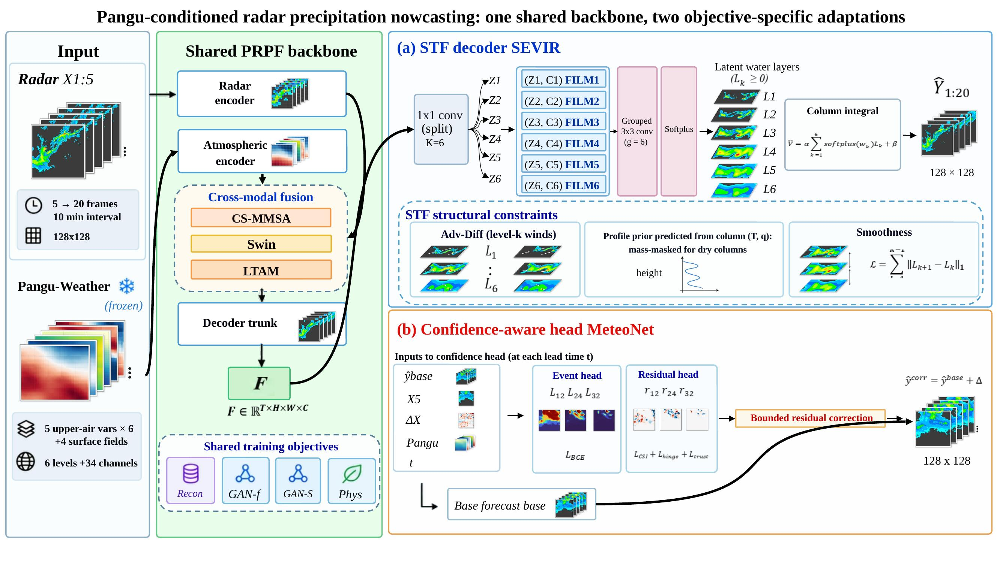

# Pangu-Conditioned Radar Precipitation Nowcasting with Structure-Preserving and Confidence-Aware Adaptation

Code and pretrained weights for our ICASSP 2027 submission (under review).



A frozen Pangu-Weather forecast conditions a radar nowcasting generator (5 → 20 frames, 10-min cadence, 128×128).

* **SEVIR – STF decoder** (`sevir/stf`): K = 6 level groups × 16 channels, zero-initialised grouped FiLM on the level-matched Pangu variables, grouped convolutions, non-negative latent layers combined by a weighted column integral; per-layer advection–diffusion, profile prior and vertical smoothness (`STFDecoder`, `ProfilePriorHead` in `sevir/stf/model_v2.py`). `sevir/m0` is the same-protocol control.
* **MeteoNet – confidence-aware event decisions** (`meteonet/`): `MeteoNetConfidenceHead` predicts event probabilities for 12 / 24 / 32 dBZ on a frozen generator; at inference the forecast is corrected only inside ±3 dBZ bands around each threshold by a per-threshold bias modulated by the event probability (`prpf/confidence_band_bias.py`, coefficients stored in the checkpoint).

## Structure
```
sevir/      m0/ (control)   stf/ (STF model)   splits/ (index files)
meteonet/   prpf/ (models, data, heads)   scripts/ (entry points)   splits/ (sample IDs)
checkpoints/  download instructions + checksums      docs/  DATA.md, REPRODUCE.md      tools/  strip_checkpoint.py
```

## Installation
```bash
git clone https://github.com/GotoHitori/PRPF-Adapt.git && cd PRPF-Adapt
conda env create -f environment.yml && conda activate prpf-adapt     # or: pip install -r requirements.txt
```
Data: [docs/DATA.md](docs/DATA.md) · Weights: [checkpoints/README.md](checkpoints/README.md) · Commands: [docs/REPRODUCE.md](docs/REPRODUCE.md)

## Results of the released checkpoints
Single checkpoints evaluated with the scripts in this repository.

| SEVIR | MSE ↓ | CSI-133 ↑ | CSI-AVG ↑ |
| --- | ---: | ---: | ---: |
| M0 | 317.878 | 0.4975 | 0.4466 |
| STF | 311.407 | 0.5027 | 0.4489 |

| MeteoNet | MSE ↓ | CSI-12 ↑ | CSI-24 ↑ | CSI-32 ↑ | CSI-AVG ↑ |
| --- | ---: | ---: | ---: | ---: | ---: |
| M0 | 7.4969 | 0.4691 | 0.2919 | 0.0330 | 0.2647 |
| M3 base generator | 7.6870 | 0.4693 | 0.3084 | 0.0372 | 0.2716 |
| M3 + confidence-modulated band bias | 7.5735 | 0.4703 | 0.3084 | 0.0387 | 0.2725 |


## License
Code: MIT. SEVIR, MeteoNet and Pangu-Weather are subject to their own licences.
